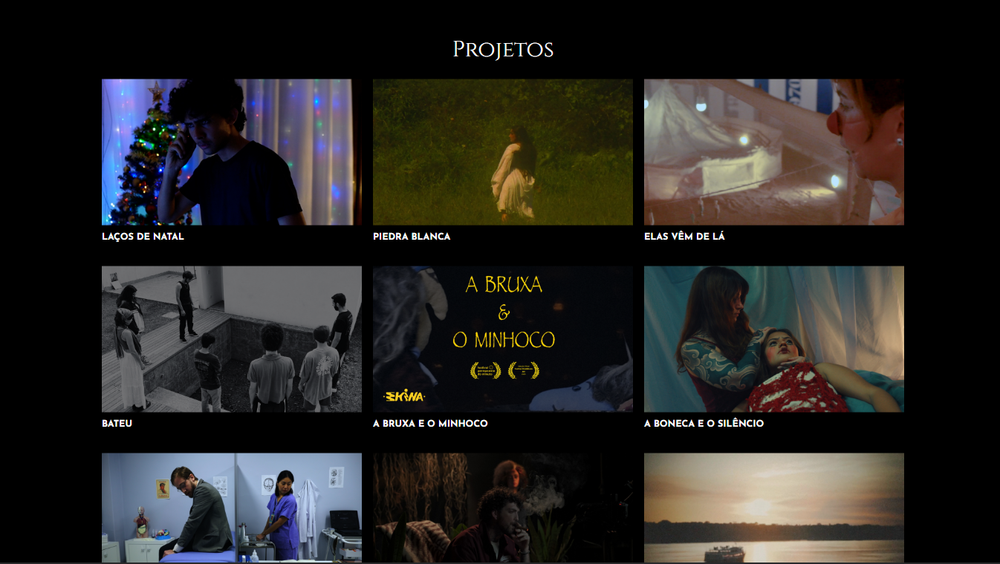
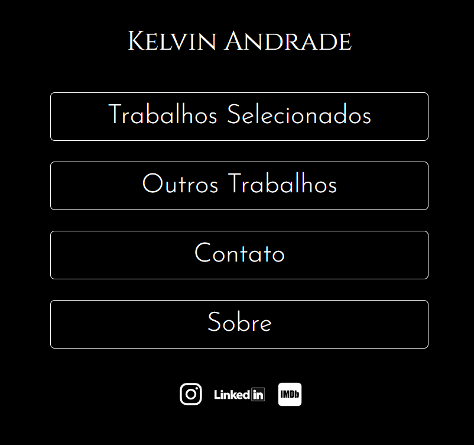
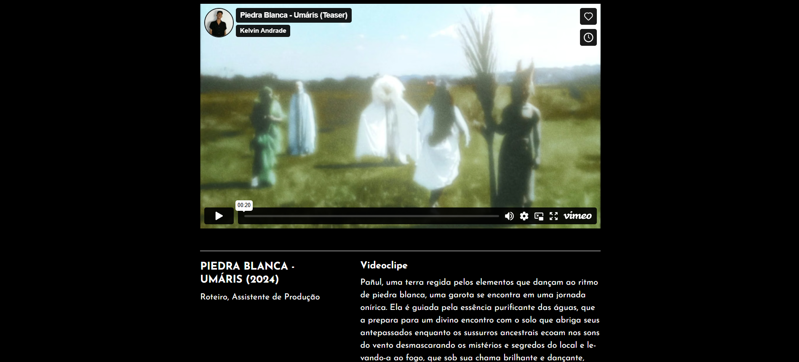

<h1 align="center"> Portfólio Audiovisual - Kelvin Andrade </h1>

Site de um Portfólio Audiovisual. Projeto freelance realizado para o Produtor Audiovisual Kelvin Andrade. 

  <a href="#-tecnologias">Tecnologias</a>&nbsp;&nbsp;&nbsp;|&nbsp;&nbsp;&nbsp;
  <a href="#-projeto">Projeto</a>&nbsp;&nbsp;&nbsp;

 

  
  
  

## 🚀 Tecnologias

Esse projeto foi desenvolvido com as seguintes tecnologias:

- HTML e CSS
- TypeScript
- React
- Tailwind
- Git e Github

## 💻 Projeto

Portfólio Audiovisual para o Produtor Audiovisual Kelvin Andrade. O site possui seções para projetos selecionados, projetos variados, páginas individuais para cada projeto com visualização de previews do YouTube ou Vimeo, uma página sobre o profissional e uma para contato, podendo enviar um email para o cliente diretamente do site, além de links para as redes sociais do cliente. O projeto está disponível no link: https://kelvinandrade.vercel.app/
